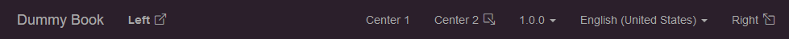

import ExternalLinkIcon from "./_external_link_icon.md";

# Template Features

Some parts of the web book template can be customized by setting values in [`template.args`](pathname:///docs/api/hexdoc/core/properties.html#TemplateProps.args).

## Navbar

To add links to the navbar, add something like this to `hexdoc.toml`:

```toml title="doc/hexdoc.toml"
[template.args.navbar]
left = [
    { text="<strong>Left</strong>", href="https://google.ca" },
]
center = [
    { text="Center 1", href="https://google.ca", external=false },
    { text="Center 2", href="https://google.ca", external=false, icon="box-arrow-down-right" },
]
right = [
    { text="Right", href="https://google.ca", icon="box-arrow-up-left" },
]
```



### Fields

|Key|Type|Description|Required?|
|---|----|-----------|---------|
|`text`|string/html|Text to be displayed in the navbar. May contain HTML.|✅|
|`href`|string|Link URL to open.|✅|
|`external`|boolean|If `true` (the default), this link will open in a new tab.||
|`icon`|string|[Bootstrap icon id](https://icons.getbootstrap.com) to display. If `external` is `true`, defaults to `box-arrow-up-right` (<ExternalLinkIcon />).||
