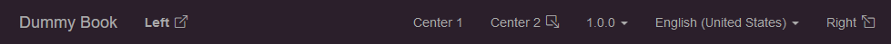
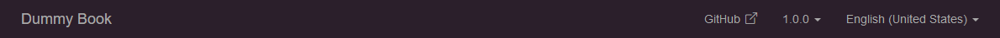

import ExternalLinkIcon from "./_external_link_icon.mdx";

# Template Features

Some parts of the web book template can be customized by setting values in [`template.args`](pathname:///docs/api/hexdoc/core/properties.html#TemplateProps.args).

## Navbar

To add links to the navbar, add something like this to `hexdoc.toml`:

```toml title="doc/hexdoc.toml"
[template.args.navbar]
left = [
    { text="<strong>Left</strong>", href="https://google.ca" },
]
center = [
    { text="Center 1", href="https://google.ca", external=false },
    { text="Center 2", href="https://google.ca", external=false, icon="box-arrow-down-right" },
]
right = [
    { text="Right", href="https://google.ca", icon="box-arrow-up-left" },
]
```



### Fields

| Key        | Type        | Description                                                                                                                                       | Required? |
| ---------- | ----------- | ------------------------------------------------------------------------------------------------------------------------------------------------- | --------- |
| `text`     | string/html | Text to be displayed in the navbar. May contain HTML.                                                                                             | ✅        |
| `href`     | string      | Link URL to open.                                                                                                                                 | ✅        |
| `external` | boolean     | If `true` (the default), this link will open in a new tab.                                                                                        |           |
| `icon`     | string      | [Bootstrap icon id](https://icons.getbootstrap.com) to display. If `external` is `true`, defaults to `box-arrow-up-right` (<ExternalLinkIcon />). |           |

:::tip

All of the above fields support [smart variables](#smart-variables).

:::

### Default links

If the `template.args.navbar` field is not present in `hexdoc.toml`, the following default value will be used:

```toml title="doc/hexdoc.toml"
[template.args.navbar]
center = [
    { text="GitHub", href.variable="source_url" },
]
```



:::note

The variable `source_url` contains a permalink to the GitHub commit tree that the book was generated from.

:::

To disable the default navbar links, you can add an empty navbar section to `hexdoc.toml`:

```toml title="doc/hexdoc.toml"
[template.args.navbar]
```

## Smart variables

Some fields in `template.args` support the use of smart variables. These can be used to look up template variable values at runtime that are not known in advance.

For example, the following [navbar](#navbar) snippet would generate a link pointing at the value of the `source_url` variable when the navbar is generated (eg. `https://github.com/hexdoc-dev/hexdoc/tree/abcdef`):

```toml title="doc/hexdoc.toml"
[template.args.navbar]
center = [
    { text="GitHub", href.variable="source_url" },
]
```

:::note

The following TOML and JSON snippets are logically equivalent:

```toml
href.variable = "source_url"
href = { variable = "source_url" }
```

```json
{
  "href": {
    "variable": "source_url"
  }
}
```

:::

On the other hand, the following snippet would generate a link pointing at the literal text `source_url` (ie. an invalid link):

```toml title="doc/hexdoc.toml"
[template.args.navbar]
center = [
    { text="GitHub", href="source_url" },
]
```

:::tip

Smart variables are implemented using the [`hexdoc_smart_var`](pathname:///docs/api/hexdoc/jinja.html#hexdoc_smart_var) filter, provided by hexdoc. You can use it in your own templates as follows:

```jinja
{{ variable_name|hexdoc_smart_var }}
```

:::
