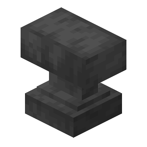
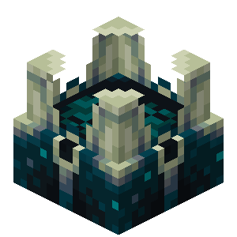
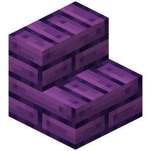
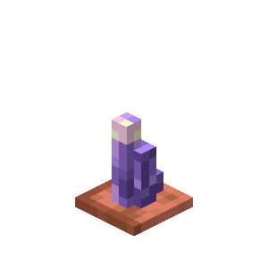

# Model Rendering

hexdoc includes a [fairly advanced module](../../textures) for rendering block models. It runs by default when building a web book, but you can also use it as a standalone tool with a bit of configuration.

For a complete example, see [examples/model_rendering](https://github.com/hexdoc-dev/hexdoc/tree/main/examples/model_rendering) in hexdoc's GitHub repo.

## Setup

1. In a [virtual environment](https://packaging.python.org/en/latest/guides/installing-using-pip-and-virtual-environments/#create-and-use-virtual-environments), install the following Python packages:
   * `hexdoc>=1!0.1.0a15`
   * `hexdoc-minecraft~={GAME_VERSION}.0` (eg. `hexdoc-minecraft~=1.19.2.0`)
2. Create a [`hexdoc.toml` config file](../../configuration):

    ```toml title="hexdoc.toml"
    #:schema https://hexdoc.hexxy.media/schema/core/Properties.json

    # for standalone model rendering, just leave this as "hexdoc"
    modid = "hexdoc"

    resource_dirs = [
        # path(s) to "resources" folders, resource packs, and/or mod jars where your models and textures are located
        "resources",
        { glob="mods/*.jar" },
        # required if your models depend on vanilla resources
        { modid="minecraft" },
        { modid="hexdoc" },
    ]

    # folder where loaded resources (not rendered models) should be copied to
    export_dir = "out/export"

    [textures]
    strict = false
    missing = [
        # add item/block/model IDs to ignore missing or broken models
        "emi:*",
    ]
    ```

## Usage

```sh
# render all available models
hexdoc render-models --all

# render a specific model
hexdoc render-model minecraft:block/stone

# render several specific models (since 1!0.1.0a16)
hexdoc render-models minecraft:anvil hexcasting:amethyst_sconce
```

## Example renders






